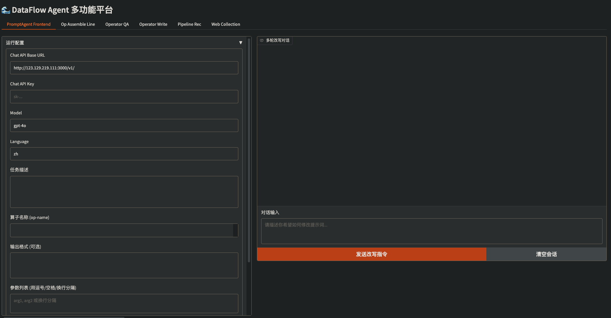
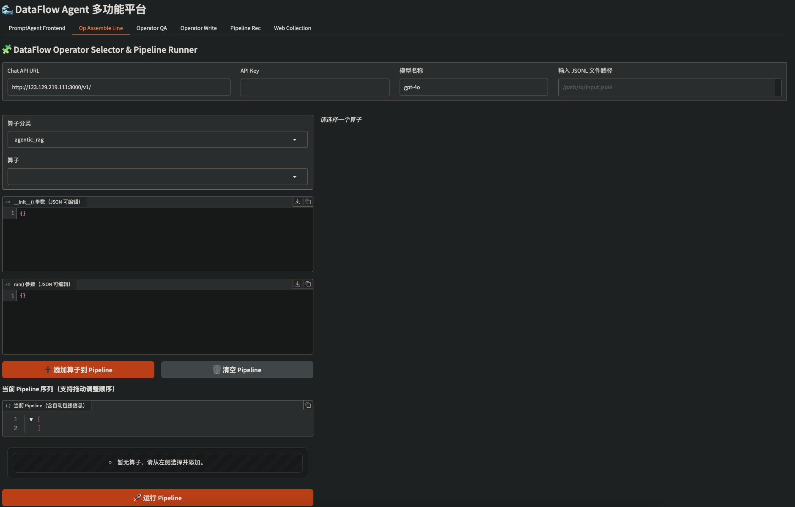
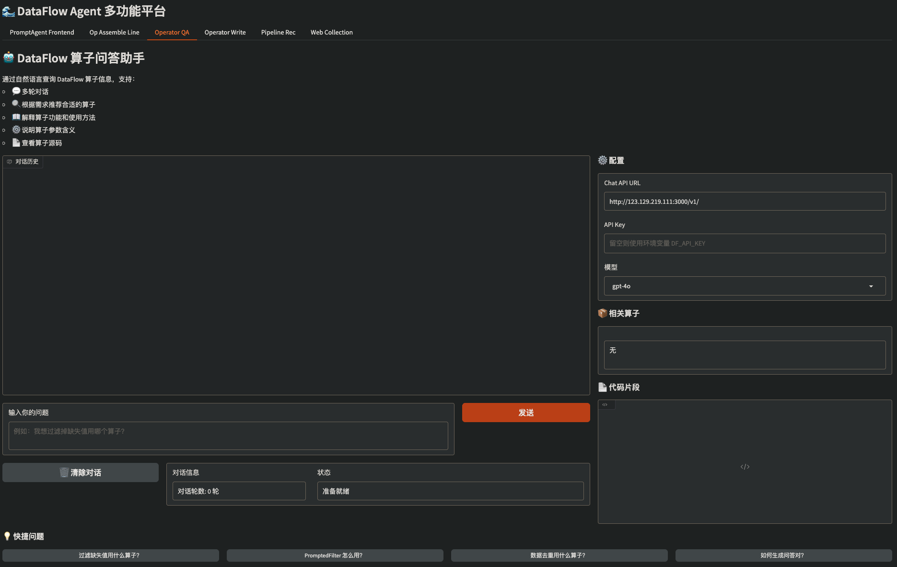
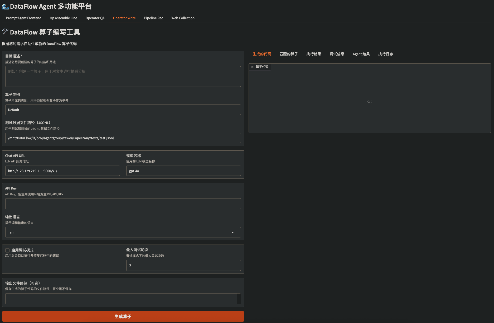
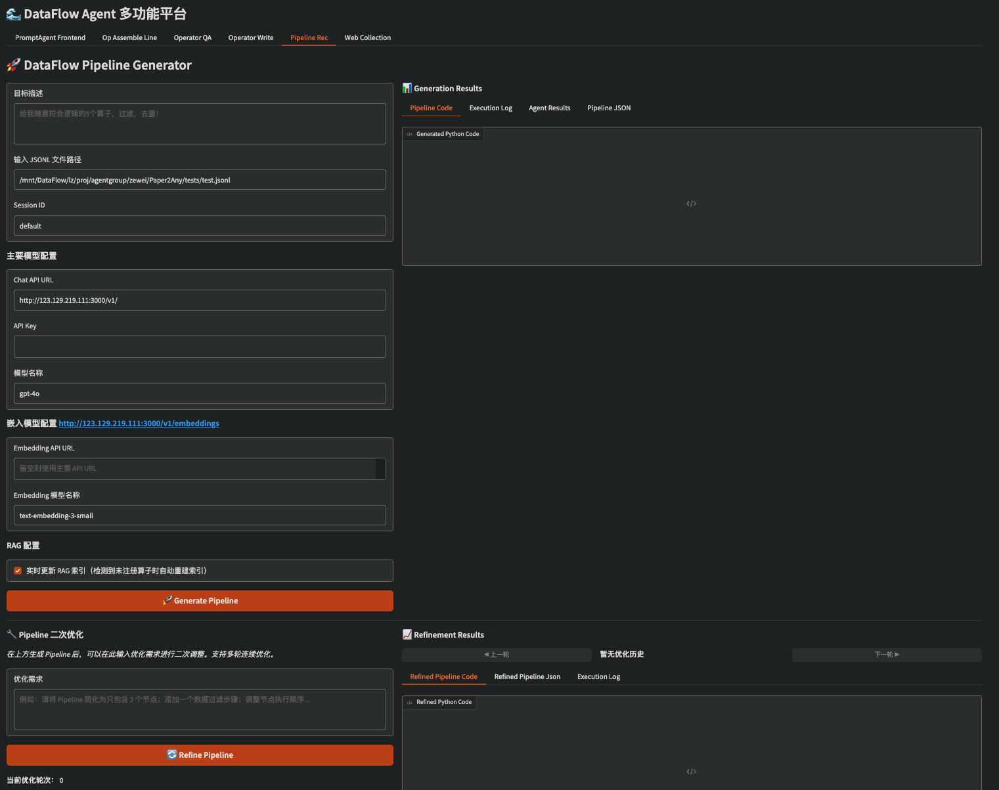
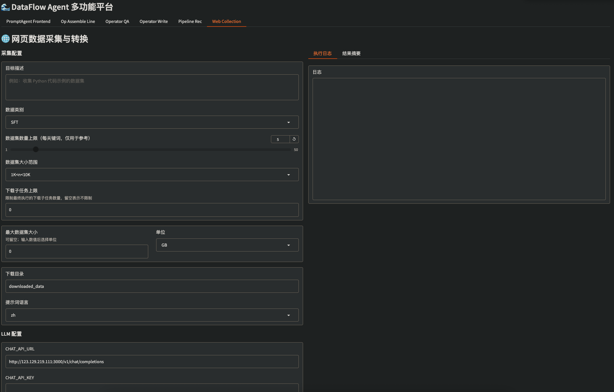

<div align="center">


# DataFlow-Agent

一个基于状态驱动（State-driven）的模块化 AI Agent 框架，提供可扩展的 `Agent / Workflow / Tool` 体系，并内置 CLI 脚手架与可视化页面，面向“数据流/算子编排”类任务（算子推荐、管线生成/调试、算子问答、网页采集等）。

[](https://github.com/OpenDCAI/DataFlow)
[](https://www.python.org/)
[](LICENSE)
[](https://github.com/OpenDCAI/DataFlow-Agent)
[](https://github.com/OpenDCAI/DataFlow-Agent/stargazers)

中文 | [English](README_EN.md)

<a href="#-快速开始">
  
</a>
<a href="docs/">
  
</a>
<a href="docs/contributing.md">
  
</a>

</div>

---

## 📑 目录

- [DataFlow-Agent](#dataflow-agent)
  - [📑 目录](#-目录)
  - [特性](#特性)
  - [功能概览](#功能概览)
  - [功能详情](#功能详情)
    - [PromptAgent Frontend](#promptagent-frontend)
    - [Op Assemble Line](#op-assemble-line)
    - [Operator QA](#operator-qa)
    - [Operator Write](#operator-write)
    - [Pipeline Rec](#pipeline-rec)
    - [Web Collection](#web-collection)
  - [🚀 快速开始](#-快速开始)
    - [1) 克隆仓库](#1-克隆仓库)
    - [2) 创建虚拟环境](#2-创建虚拟环境)
    - [3) 安装依赖](#3-安装依赖)
  - [启动 UI（Gradio）](#启动-uigradio)
  - [CLI 使用](#cli-使用)
  - [工作流（Workflows）](#工作流workflows)
  - [配置与环境变量](#配置与环境变量)
    - [LLM 相关](#llm-相关)
    - [路径相关（可选）](#路径相关可选)
  - [文档（MkDocs）](#文档mkdocs)
  - [项目结构](#项目结构)
  - [Roadmap](#roadmap)
  - [贡献](#贡献)
  - [License](#license)
  - [加入社区](#加入社区)

---

## 特性

- **统一状态模型**：围绕 `MainState / DFState` 等状态对象组织多智能体执行过程。
- **Agent 插件化**：通过注册机制自动发现/加载 Agent，实现灵活组合。
- **Workflow 编排**：基于图结构编排节点（GraphBuilder），支持复杂流程与工具调用。
- **工具管理**：通过 `ToolManager` 注入 pre-tools/post-tools，统一管理工具与权限边界。
- **可视化页面**：内置 `gradio_app/` 多页面，用于 operator/pipeline/prompt/web collection 等常见能力。
- **CLI 脚手架**：`dfa create` 一键生成 workflow/agent/gradio page/prompt/state 等模板。

---

## 功能概览

DataFlow Agent 多功能平台（Gradio）包含 6 个页面（截图位于 `static/dfa/`）：

- [PromptAgent Frontend](#promptagent-frontend)：生成/优化算子 Prompt Template。
- [Op Assemble Line](#op-assemble-line)：选择算子并组装 Pipeline，支持调试运行。
- [Operator QA](#operator-qa)：面向算子/工具的问答助手，便于理解用法与参数。
- [Operator Write](#operator-write)：从需求描述生成自定义算子代码，并在页面内测试/调试。
- [Pipeline Rec](#pipeline-rec)：从任务描述生成 Pipeline，并支持进一步 refine。
- [Web Collection](#web-collection)：网页数据采集与结构化转换，面向数据生产/治理链路。

---

## 功能详情

### PromptAgent Frontend

复用现有算子，面向“算子 Prompt Template”做生成与迭代优化：

- 输入：任务描述、算子名称（op-name）、参数列表、输出格式等（可选）
- 输出：可复用的 Prompt Template / 改写建议（便于沉淀到 Prompt 仓库）

<div align="center">
  
</div>

---

### Op Assemble Line

从算子库里选择合适的算子，快速拼装成可执行 Pipeline，并支持调试运行：

- 选择算子分类与具体算子
- 配置算子参数（JSON）并加入 Pipeline 队列
- 一键运行 Pipeline，便于端到端验证

<div align="center">
  
</div>

---

### Operator QA

面向算子/工具的问答助手，帮助快速理解“怎么用 / 用什么 / 注意什么”：

- 推荐相关算子（按需求定位）
- 解释算子输入/输出与关键参数
- 给出用法示例与可直接复用的片段

<div align="center">
  
</div>

---

### Operator Write

从目标描述自动生成 DataFlow 算子代码，并在同一页面内完成测试与调试闭环：

- 生成代码：根据目标描述与约束生成算子实现
- 匹配算子：对齐已有算子/规范，便于纳入算子库
- 执行与调试：查看执行结果、调试信息与日志

<div align="center">
  
</div>

---

### Pipeline Rec

从任务描述自动生成可执行 Pipeline（代码/JSON），并支持多轮 refine：

- 生成：将自然语言任务映射为算子组合与执行顺序
- 迭代：在已有 Pipeline 基础上做二次优化（refine）
- 产物：Pipeline 代码 / Pipeline JSON / 执行日志等

<div align="center">
  
</div>

---

### Web Collection

网页数据采集与结构化转换，面向“数据生产 → 数据治理/训练数据”链路：

- 配置采集目标、数据类型与规模
- 自动采集并输出结构化结果
- 支持执行日志与结果摘要查看

<div align="center">
  
</div>

---

## 🚀 快速开始

### 1) 克隆仓库

```bash
git clone https://github.com/OpenDCAI/DataFlow-Agent
cd DataFlow-Agent
```

### 2) 创建虚拟环境

```bash
python -m venv venv
source venv/bin/activate  # Windows: venv\\Scripts\\activate

or

conda create -n myenv python=3.11
conda activate myenv
```

### 3) 安装依赖

开发/本地调试推荐：

```bash
pip install -r requirements-data.txt
pip install -e .
```

---

## 启动 UI（Gradio）

只加载数据流相关页面集合（推荐）：

```bash
python gradio_app/app.py --page_set data
```

页面入口（6 个）：

- PromptAgent Frontend / Op Assemble Line / Operator QA / Operator Write / Pipeline Rec / Web Collection

默认端口：

- 环境变量 `GRADIO_SERVER_PORT` 或命令行 `--server_port`（默认 7860）
- 服务监听地址可用 `GRADIO_SERVER_NAME`（默认 `0.0.0.0`）

---

## CLI 使用

查看 CLI 帮助：

```bash
dfa --help
```

常用脚手架命令：

```bash
dfa create --agent_name my_agent
dfa create --wf_name my_workflow
dfa create --gradio_name my_page
dfa create --prompt_name my_prompt
dfa create --state_name my_state
```

生成文件位置（约定）：

- Workflow：`dataflow_agent/workflow/wf_<name>.py`
- Agent：`dataflow_agent/agentroles/common_agents/<name>_agent.py`
- Gradio Page：`gradio_app/pages/page_<name>.py`
- Prompt Template：`dataflow_agent/promptstemplates/resources/pt_<name>_repo.py`
- State：`dataflow_agent/states/<name>_state.py`

---

## 工作流（Workflows）

工作流位于 `dataflow_agent/workflow/`，文件名约定 `wf_*.py`。系统启动时会尝试自动导入并注册工作流；若某个工作流依赖的外部环境/包缺失，会在日志中提示并跳过导入。

查看当前成功注册的工作流：

```bash
python - <<'PY'
from dataflow_agent.workflow import list_workflows
print(sorted(list_workflows()))
PY
```

运行方式（以 `run_workflow` 为例）：

```bash
python - <<'PY'
import asyncio
from dataflow_agent.workflow import run_workflow
from dataflow_agent.state import MainState

async def main():
    state = MainState()
    out = await run_workflow("operator_qa", state)
    print(out)

asyncio.run(main())
PY
```

---

## 配置与环境变量

### LLM 相关

- `DF_API_URL`：LLM API Base URL（默认 `test`）
- `DF_API_KEY`：API Key（默认 `test`）
- `DATAFLOW_LOG_LEVEL`：日志级别（默认 `INFO`）
- `DATAFLOW_LOG_FILE`：日志文件（默认 `dataflow_agent.log`）

### 路径相关（可选）

`dataflow_agent/state.py` 会尽量通过 `dataflow.cli_funcs.paths.DataFlowPath` 获取路径；若外部包不可用，则回退到环境变量：

- `DATAFLOW_DIR`：数据目录根路径（默认使用仓库根路径）
- `DATAFLOW_STATICS_DIR`：静态目录（默认 `./statics`）

---

## 文档（MkDocs）

启动本地文档站点：

```bash
mkdocs serve
```

配置文件：`mkdocs.yml`

---

## 项目结构

```
DataFlow-Agent/
├── dataflow_agent/          # 核心框架代码
├── gradio_app/              # Gradio Web 界面
├── docs/                    # 文档
├── static/                  # 静态资源（README 图片等）
├── script/                  # 脚本工具
└── tests/                   # 测试用例
```

---

## Roadmap

| 功能 | 状态 | 子功能 |
| --- | --- | --- |
| 🔄 Easy-DataFlow（数据治理管线） | ✅ 已完成 | 管线推荐 / 算子编写 / 可视化编排 / Prompt 优化 / Web 采集 |
| 🎨 Workflow 可视化编辑器（拖拽式工作流构建器） | 🚧 开发中 | 拖拽界面 / 5 种 Agent 模式 / 20+ 预设节点 |
| 💾 轨迹数据导出（训练数据导出） | 🚧 开发中 | JSON/JSONL 格式 / SFT 格式 / DPO 格式 |

---

## 贡献

我们欢迎所有形式的贡献！

- 提交 Bug / 功能建议：https://github.com/OpenDCAI/DataFlow-Agent/issues
- 参与讨论：https://github.com/OpenDCAI/DataFlow-Agent/discussions
- 提交代码：https://github.com/OpenDCAI/DataFlow-Agent/pulls
- 贡献指南：`docs/contributing.md`

---

## License

Apache-2.0，见 `LICENSE`。

---

## 加入社区

- 📮 GitHub Issues：https://github.com/OpenDCAI/DataFlow-Agent/issues
- 🔧 GitHub Pull Requests：https://github.com/OpenDCAI/DataFlow-Agent/pulls
- 💬 社区交流群：与开发者和贡献者实时交流

<div align="center">
  
  <br>
  <sub>扫码加入 DataFlow-Agent 社区微信群</sub>
</div>
